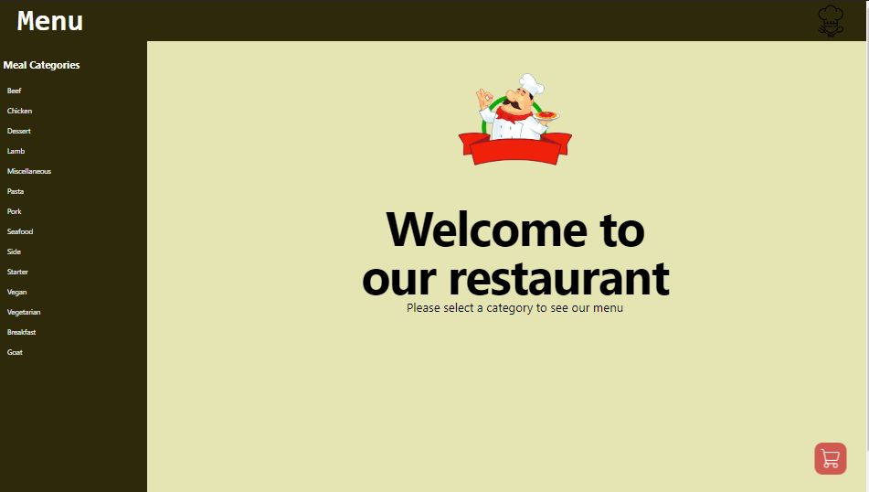
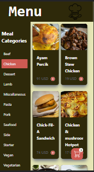
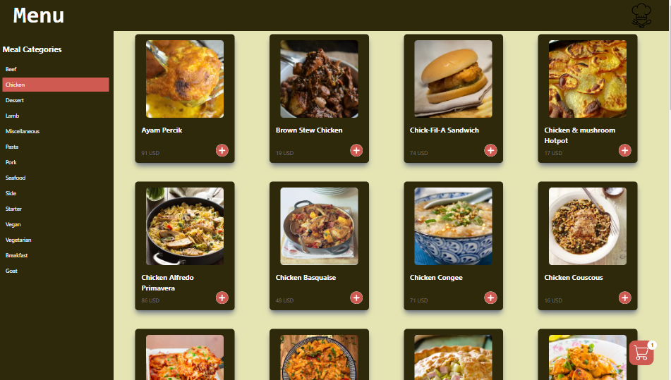
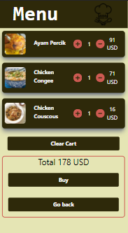
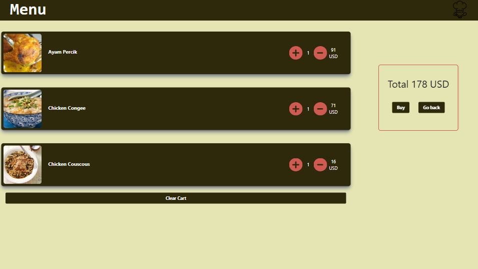
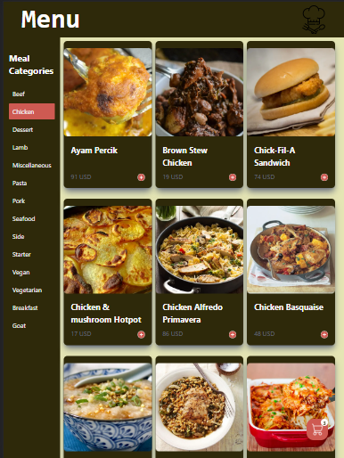

# Food App

This app is a menu that shows meals by categories and allows to add them to a shopping cart where the user can add more or remove items and clear the shopping cart.

The API is a Rails Api that works as a middleware pointing to a third party service (https://www.themealdb.com/api/). The Rails API iterates over the third party data to bring add a random price to every meal it brings.

The price assignment has some business logic over three categories: Lamb, Beef, Pork. The API assigns a random price to the first meal category that receives a request. Then the other categories must meet this requirement `Lamb > Beef > Pork`.

The Client is a NEXT JS app that uses tailwind css and typescript. The grid of meals is rendered with dynamic routing, changing every time the category changes in the pathname params. The logic of the shopping cart is made with Context to use its props over the application without too much complication.


## Screenshots









## API Reference

#### Get Categories

```http
  GET /categories or /
```


#### Get Meals by category

```http
  GET /categories/${categoryName}
```

| Parameter | Type     | Description                       |
| :-------- | :------- | :-------------------------------- |
| `categoryName`      | `string` | **Required**. Name of meals category to fetch |


## System dependencies

- Ruby 2.7.7
- Rails 6.1.4
- Node 18.14.0
- npm 9.3.1

## Configuration

Use `rbenv`. See https://github.com/rbenv/rbenv

## Installing

```sh
# Clone the repo
git clone <this repo>

# Move to api folder
cd api

# Install the gems
bundle install

# Move to client folder
 cd ../client

# Install needed packages
npm install
```

## Running in local

```sh
# Start the dev server in api folder
rails s
```

Must add the variable in .env located in the client folder 
```sh
# .env folder located in ./client
NEXT_PUBLIC_API_URL =http://localhost:3001
```
```sh
# Run the frontend project in client folder
npm run dev
```

## Test suite

```sh
# Run tests
bundle exec rspec
```